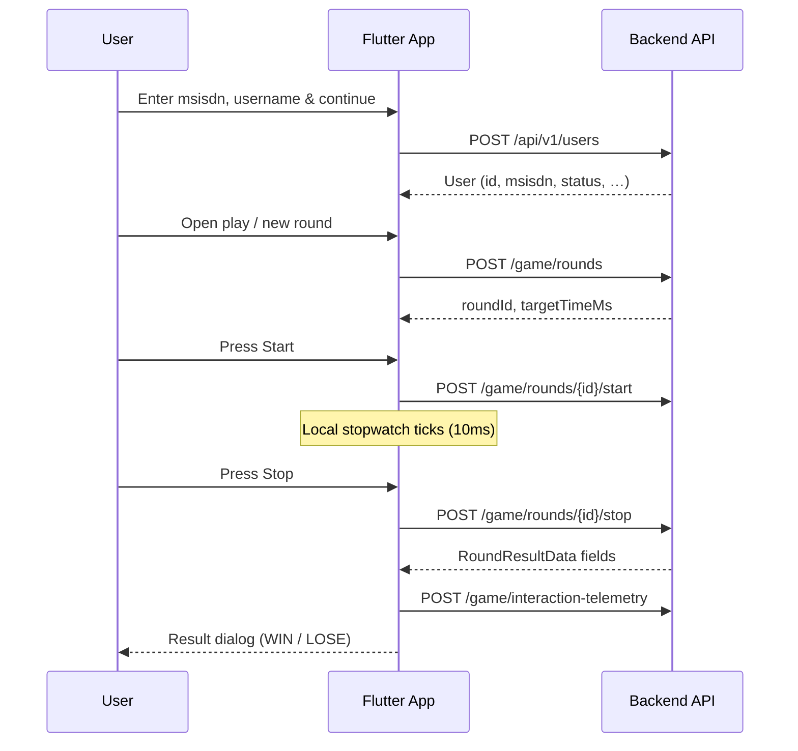

# Stopwatch Challenge — API Documentation

This document describes the HTTP API contract required by the **Stopwatch Challenge** Flutter client (`stopwatch_game`). The mobile/web app currently uses local stubs for auth and round scoring; backend implementations should follow this spec so the client can replace its `TODO` integration points without changing game UX.

---

## Table of contents

1. [Overview](#overview)
2. [Conventions](#conventions)
3. [Users](#users)
4. [Game rounds](#game-rounds)
5. [Interaction telemetry](#interaction-telemetry)
6. [Data models](#data-models)
7. [Client integration flow](#client-integration-flow)
8. [Errors](#errors)
9. [Security & integrity](#security--integrity)
10. [Client integration status](#client-integration-status)

---

## Overview

**Stopwatch Challenge** is a precision timing game: the player must start a stopwatch and stop as close as possible to a **target time**. Outcomes, prizes, and target assignment must be **authoritative on the server**—the client only displays results returned by the API and collects anti-automation telemetry.

| Concern | Owner |
|--------|--------|
| Win/lose decision, prize coins, tolerance | **Server** |
| Stopwatch UI, pointer samples, session metrics | **Client** |
| User registration (`msisdn`, `username`) | **Server** |

**Base URL (configured backend):**

Set `API_BASE_URL` in the project `.env` file. The application does not contain
a fallback host.

**Interactive API reference (Swagger UI):**

`${API_BASE_URL}/swagger-ui/index.html`

OpenAPI: `GET /v3/api-docs` on the same host.

| Environment | Base URL |
|-------------|----------|
| **Current (development)** | Value of `API_BASE_URL` in `.env` |

All endpoints below are relative to this base URL. Example — register user:

```
POST ${API_BASE_URL}/api/v1/users
```

> **Note:** This host uses plain HTTP. Use HTTPS with a proper domain before production release.

---

## Conventions

### Versioning

- URL prefix: `/api/v1`
- Breaking changes require a new major version (`/api/v2`).

### Request headers

| Header | Required | Description |
|--------|----------|-------------|
| `Content-Type` | Yes (JSON bodies) | `application/json` |
| `Authorization` | Yes (game + billing) | `Bearer <access_token>` from `POST /api/v1/auth/verify-otp` |
| `X-TIMESTAMP` | When HMAC enabled | ISO-8601 UTC, e.g. `2026-05-19T14:00:00.000Z` |
| `X-NONCE` | When HMAC enabled | Unique per request (UUID) |
| `X-SIGNATURE` | When HMAC enabled | Lowercase hex HMAC-SHA256 of signing payload |
| `Accept` | Recommended | `application/json` |
| `X-Client-Version` | Recommended | App version, e.g. `1.0.0+1` |
| `X-Platform` | Recommended | `web`, `android`, `ios`, `windows`, `linux`, `macos` |
| `X-Request-Id` | Optional | Client-generated UUID for tracing |

### Time formats

- **Durations in JSON:** integer milliseconds unless noted.
- **Timestamps:** ISO-8601 UTC strings, e.g. `2026-05-18T14:32:01.123Z`.
- **Display labels** (e.g. `finalTimeLabel`): `MM:SS.mmm` — produced by the server for consistency.

### Idempotency

`POST` endpoints that finalize state (`/stop`, prize grant) should accept:

| Header | Description |
|--------|-------------|
| `Idempotency-Key` | Unique per user action; repeat requests return the same response without double-awarding prizes |

---

## Auth (OTP + JWT)

| Method | Endpoint | Purpose |
|--------|----------|---------|
| `POST` | `/api/v1/auth/login` | Log in — body `{ "msisdn" }` |
| `POST` | `/api/v1/auth/verify-otp` | Verify OTP — body `{ "msisdn", "otp" }` → JWT + `user` |
| `POST` | `/api/v1/auth/logout` | Revoke JWT — `204 No Content` |

**Verify OTP response:** `accessToken`, `tokenType`, `expiresInSeconds`, `user` (same shape as `POST /users`).

**Login response**

- `status: "OTP_REQUIRED"` — show OTP step; fields include `msisdn`, `expiresInSeconds`, `message` (e.g. `"OTP sent"`).
- Any other `status` — client shows `message` / body text; if the body includes `accessToken` + `user`, treat as signed in without OTP.

**Client flow:** `auth/login` → (if `OTP_REQUIRED`) `auth/verify-otp` → store Bearer token → game.

Stub/dev: `auth/login` may include `otp` in the JSON response for testing.

---

## Users

**Client:** `AuthService.registerUser`, `AuthService.getUserById`.

### Get user by id (live)

```http
GET /api/v1/users/{id}
```

**Client:** Optional profile refresh (`getUserById`).

---

### Register user (live)

**Registration only** — not used for sign-in.

```http
POST /api/v1/users
```

**Headers**

| Header | Value |
|--------|--------|
| `accept` | `application/json` |
| `Content-Type` | `application/json` |

**Request body (Swagger)**

```json
{
  "msisdn": "255676589824"
}
```

| Field | Type | Required | Description |
|-------|------|----------|-------------|
| `msisdn` | string | Yes | Mobile number (e.g. Tanzania `255…`) |

**cURL example**

```bash
curl -X 'POST' \
  "${API_BASE_URL}/api/v1/users" \
  -H 'accept: application/json' \
  -H 'Content-Type: application/json' \
  -d '{"msisdn": "255676589824"}'
```

**Success — `200 OK`**

```json
{
  "id": 2,
  "msisdn": "255676589824",
  "username": "KIBABU",
  "channelSource": "WEB",
  "status": "active",
  "createdAt": "2026-05-18T07:56:40.814919639Z",
  "updatedAt": "2026-05-18T07:56:40.814919639Z",
  "lastLoginAt": null
}
```

**Response fields**

| Field | Type | Description |
|-------|------|-------------|
| `id` | integer | Server user id — persist for later game/telemetry calls |
| `msisdn` | string | Registered mobile number |
| `username` | string | Registered username |
| `channelSource` | string | Channel used at registration |
| `status` | string | Account status (e.g. `active`) |
| `createdAt` | string (ISO-8601) | Record creation time |
| `updatedAt` | string (ISO-8601) | Last update time |
| `lastLoginAt` | string \| null | Last login timestamp, or `null` on first registration |

**Response headers (observed)**

| Header | Example value |
|--------|-----------------|
| `content-type` | `application/json` |
| `cache-control` | `no-cache, no-store, max-age=0, must-revalidate` |
| `x-content-type-options` | `nosniff` |
| `x-frame-options` | `DENY` |

**Client mapping**

| App field | API field |
|-----------|-----------|
| Login phone input | `msisdn` |

Server sets `channelSource=APP` and `status=active` for new users. **Sign-in never calls `POST /users`.** Store JWT and `user.id` after `auth/verify-otp`.

---

## Game rounds

### Fetch target time (live)

Used when opening or resetting the play board (`GameController.openRoundBoard`, `onResetPressed`).

### Enqueue billing (live)

Called when the player taps **Play** on the home screen (`GameController.openRoundBoard`). Enqueues a Yas payment; the returned `requestId` is passed to `POST /game/start` as `billingRequestId`.

```http
POST /api/v1/billing/transactions
```

**Request body**

```json
{
  "msisdn": "255676589824",
  "amount": 0.01
}
```

| Field | Required | Notes |
|-------|----------|--------|
| `msisdn` | Yes | Player mobile number |
| `amount` | Yes (OpenAPI) | Must be ≥ `0.01`; **ignored** for charging — server uses `stopwatch.billing.entry-fee` |

The app sends placeholder `amount: 0.01` only to satisfy validation.

**Success — `200 OK`**

```json
{
  "id": 0,
  "msisdn": "255676589824",
  "requestId": "string",
  "billingType": "string",
  "amount": 0.01,
  "status": "pending",
  "createdAt": "2026-05-18T11:39:10.126Z",
  "updatedAt": "2026-05-18T11:39:10.126Z"
}
```

**Client:** `GameService.enqueueBilling` — sends `msisdn` + placeholder `amount`; `amount` in the response reflects the server-side fee.

After enqueue, the app polls **Get billing transaction status** until `success` or `failed` (Yas updates the record via the callback webhook below).

---

### Get billing transaction status (live)

Portal polling while Yas processes the charge. Status lifecycle: `pending` → `acknowledged` → `success` | `failed`.

```http
GET /api/v1/billing/transactions/{requestId}
```

**Path**

| Name | Description |
|------|-------------|
| `requestId` | Value returned from **Enqueue billing** |

**Success — `200 OK`**

Same schema as **Enqueue billing** (`BillingTransactionResponse`), with `status` updated as Yas ACK/callback events arrive.

**Client:** `GameService.waitForBillingSuccess` — exponential backoff between polls starting at `BILLING_POLL_INTERVAL_MS` (default `2000`), multiplier `BILLING_POLL_BACKOFF_MULTIPLIER` (default `1.5`), cap `BILLING_POLL_BACKOFF_MAX_MS` (default `12000`), with jitter ±15% on each wait. Stops when status is terminal or `BILLING_POLL_TIMEOUT_MS` (default `30000`) elapses.

---

### Yas CP_NOTIFICATION callback (server only)

Inbound webhook from **Yas SDP** — not called by the Flutter app. Yas posts charge results here; your backend persists them and updates the transaction row the app polls above.

```http
POST /api/v1/billing/callbacks/yas
```

**Request body (excerpt)**

```json
{
  "isGenericOffer": true,
  "requestId": "string",
  "requestTimeStamp": "string",
  "requestParam": {
    "data": [{ "name": "string", "value": "string" }]
  },
  "operation": "string"
}
```

**Success — `200 OK` (Yas ACK JSON)**

```json
{
  "requestId": "string",
  "responseId": "string",
  "responseTimeStamp": "string",
  "operation": "string",
  "responseParam": {
    "status": "string",
    "statusCode": "string",
    "description": "string"
  }
}
```

---

### Allocate target time (live)

```http
POST /api/v1/game/target-time
```

**Request body**

```json
{
  "msisdn": "255676589824"
}
```

**Success — `200 OK`**

```json
{
  "msisdn": "255676589824",
  "targetTimeMs": 160835
}
```

**Client:** `GameService.fetchTargetTime` — runs after billing when the user taps **Play**.

---

### Start game session (live)

Called when the player presses **Start round** (`GameController.startGame`). Requires a prior target-time allocation and billing.

```http
POST /api/v1/game/start
```

**Request body**

```json
{
  "msisdn": "255676589824",
  "billingRequestId": "string",
  "channel": "SMS"
}
```

**Success — `200 OK`**

```json
{
  "id": 0,
  "sessionRef": "string",
  "billingRequestId": "string",
  "msisdn": "string",
  "channel": "SMS",
  "entryFee": 0,
  "targetTimeMs": 160835,
  "status": "string",
  "startedAt": "2026-05-18T11:23:02.613Z",
  "endedAt": null,
  "result": null
}
```

**Client:** `GameService.startGameSession` — uses `billingRequestId` from target-time (or derived id). Channel from `GAME_CHANNEL` in `.env` (default `SMS`).

---

### Stop game session (live)

Called when the player presses **Stop round** (`GameController.stopGame`).

```http
POST /api/v1/game/stop
```

**Request body**

```json
{
  "sessionRef": "string",
  "stoppedTimeMs": 0
}
```

**Success — `200 OK`**

Returns the completed session (same schema as start). If the body is empty, the client falls back to `GET /game/sessions/{sessionRef}`.

**Client:** `GameService.stopGameSession`

---

### Get game session (live)

Lookup session by `sessionRef` (same value as `billingRequestId`). Used after stop if the stop response has no `result`.

```http
GET /api/v1/game/sessions/{sessionRef}
```

**Success — `200 OK`**

Same schema as start response; `result` is populated when the round is complete.

**Client:** `GameService.getGameSession` → `GameSessionMapper.toRoundResult`. Falls back to local scoring if `result` is null.

---

Round lifecycle maps to `GameController` methods:

| Client method | Intended API call |
|---------------|-------------------|
| `openRoundBoard()` | `POST /api/v1/game/target-time` |
| `startGame()` | `POST /api/v1/game/start` |
| `stopGame()` + `fetchRoundResultFromBackend()` | `POST /game/stop` then `GET /game/sessions/{sessionRef}` if needed |

### Game rules (server-enforced)

These values mirror the current client stub in `fetchRoundResultFromBackend` and should be configurable server-side:

| Rule | Value |
|------|--------|
| Target time range | **3 000–12 000 ms**, snapped to **10 ms** steps |
| Win tolerance | **±100 ms** from target |
| Perfect-stop prize | **100 coins** (`Perfect Stop Reward`) |
| Outcome labels | `WIN` or `LOSE` |

The server must **not** trust client-reported elapsed time alone; record authoritative start/stop timestamps server-side when `start` and `stop` are called.

---

### Create round

Issues a new round with server-generated target time and interaction session id.

```http
POST /api/v1/game/rounds
```

**Request body**

```json
{
  "interactionSessionId": "1716035520123456-48291"
}
```

| Field | Type | Required | Description |
|-------|------|----------|-------------|
| `interactionSessionId` | string | No | Client session id; server may echo or replace |

**Success — `201 Created`**

```json
{
  "roundId": "rnd_01HXYZ",
  "targetTimeMs": 8200,
  "targetTimeLabel": "00:08.200",
  "interactionSessionId": "1716035520123456-48291",
  "status": "ready"
}
```

**Client mapping:** call when opening the play board (`openRoundBoard` / reset).

---

### Start round

Marks the round as running and records server start time.

```http
POST /api/v1/game/rounds/{roundId}/start
```

**Path parameters**

| Name | Description |
|------|-------------|
| `roundId` | Round from create response |

**Request body**

```json
{
  "interactionSessionId": "1716035520123456-48291",
  "clientStartedAt": "2026-05-18T14:32:01.123Z"
}
```

**Success — `200 OK`**

```json
{
  "roundId": "rnd_01HXYZ",
  "status": "running",
  "serverStartedAt": "2026-05-18T14:32:01.145Z"
}
```

**Errors:** `404` (unknown round), `409` (round not in `ready` state)

**Client mapping:** `GameController.startGame()` — invoked when the user presses **Start**.

---

### Stop round & get result

Ends the round and returns the authoritative outcome. This replaces local `fetchRoundResultFromBackend`.

```http
POST /api/v1/game/rounds/{roundId}/stop
```

**Request body**

```json
{
  "interactionSessionId": "1716035520123456-48291",
  "clientStoppedAt": "2026-05-18T14:32:09.367Z",
  "clientElapsedMs": 8222
}
```

| Field | Type | Required | Description |
|-------|------|----------|-------------|
| `clientStoppedAt` | string (ISO-8601) | Recommended | For audit only |
| `clientElapsedMs` | integer | Recommended | For audit only; **do not** use as sole source of truth |

**Success — `200 OK`**

```json
{
  "roundId": "rnd_01HXYZ",
  "status": "completed",
  "outcomeLabel": "WIN",
  "deltaLabel": "Great timing! Within +/-100 ms. Prize unlocked!",
  "finalTimeLabel": "00:08.222",
  "differenceMs": 22,
  "prizeLabel": "Perfect Stop Reward",
  "prizeCoins": 100,
  "isPrizeAwarded": true,
  "serverElapsedMs": 8222,
  "targetTimeMs": 8200
}
```

**LOSE example**

```json
{
  "roundId": "rnd_01HXYZ",
  "status": "completed",
  "outcomeLabel": "LOSE",
  "deltaLabel": "Late by 250 ms",
  "finalTimeLabel": "00:08.450",
  "differenceMs": 250,
  "prizeLabel": "No prize",
  "prizeCoins": 0,
  "isPrizeAwarded": false,
  "serverElapsedMs": 8450,
  "targetTimeMs": 8200
}
```

**Response field notes**

| Field | Maps to client `RoundResultData` |
|-------|----------------------------------|
| `outcomeLabel` | `outcomeLabel` |
| `deltaLabel` | `deltaLabel` |
| `finalTimeLabel` | `finalTimeLabel` |
| `differenceMs` | `differenceMs` (signed: negative = early, positive = late) |
| `prizeLabel` | `prizeLabel` |
| `prizeCoins` | `prizeCoins` |
| `isPrizeAwarded` | `isPrizeAwarded` |

**Errors:** `404`, `409` (not running), `422` (invalid stop)

**Client mapping:** `GameController.stopGame()` then map response to `RoundResultData`.

---

### Round history (optional)

The client keeps history in memory today. For cross-device history, provide:

```http
GET /api/v1/game/rounds?limit=20&cursor=<opaque>
```

**Success — `200 OK`**

```json
{
  "items": [
    {
      "roundId": "rnd_01HXYZ",
      "completedAt": "2026-05-18T14:32:09.367Z",
      "finalTimeLabel": "00:08.222",
      "outcomeLabel": "WIN"
    }
  ],
  "nextCursor": null
}
```

---

### Player stats (optional)

Aggregates shown on the play screen (`totalWins`, `totalPrizeCoins`) are client-local today.

```http
GET /api/v1/game/stats
```

**Success — `200 OK`**

```json
{
  "totalWins": 12,
  "totalPrizeCoins": 1200
}
```

---

## Interaction telemetry

Anti-automation metrics collected per round from pointer events. Submitted **after** the round stops, in parallel with displaying the result.

**Client reference:** `InteractionTelemetryService.submitRoundPayload`

```http
POST /api/v1/game/interaction-telemetry
```

**Request body**

```json
{
  "reactionTime": 342,
  "movementEntropy": 2.41,
  "clickVariance": 18.6,
  "interactionConsistency": 0.87,
  "sessionId": "1716035520123456-48291",
  "timestamp": "2026-05-18T14:32:09.400Z",
  "isTrusted": true,
  "roundId": "rnd_01HXYZ"
}
```

| Field | Type | Description |
|-------|------|-------------|
| `reactionTime` | integer | Milliseconds from UI ready to first pointer down (0–60000) |
| `movementEntropy` | number | Shannon entropy (base 2) of movement direction bins; `0` if insufficient samples |
| `clickVariance` | number | Variance of down/up pointer distances per click pair |
| `interactionConsistency` | number | `0.0`–`1.0`; higher = more stable interaction patterns across recent rounds |
| `sessionId` | string | Client interaction session id |
| `timestamp` | string | ISO-8601 when payload was built |
| `isTrusted` | boolean \| null | On **web**, reflects `PointerEvent.isTrusted`; `null` on native platforms |
| `roundId` | string | Recommended — link telemetry to server round |

**Success — `202 Accepted`**

```json
{
  "received": true
}
```

Empty payloads are not sent by the client (`if (payload.isEmpty) return`).

**Server guidance:** use telemetry for fraud scoring; do not block prize payout solely on client metrics without additional signals.

---

## Data models

### `User` (server — `POST /api/v1/users` response)

| Property | Type | Example |
|----------|------|---------|
| `id` | integer | `2` |
| `msisdn` | string | `255676589824` |
| `username` | string | `KIBABU` |
| `channelSource` | string | `WEB` |
| `status` | string | `active` |
| `createdAt` | string | `2026-05-18T07:56:40.814919639Z` |
| `updatedAt` | string | `2026-05-18T07:56:40.814919639Z` |
| `lastLoginAt` | string \| null | `null` |

### `RoundResultData` (client)

| Property | Type | Example |
|----------|------|---------|
| `outcomeLabel` | string | `WIN`, `LOSE` |
| `deltaLabel` | string | Human-readable timing message |
| `finalTimeLabel` | string | `00:08.222` |
| `differenceMs` | int | Signed delta vs target |
| `prizeLabel` | string | `Perfect Stop Reward`, `No prize` |
| `prizeCoins` | int | `100` or `0` |
| `isPrizeAwarded` | bool | `true` when `prizeCoins > 0` |

### `HistoryEntry` (client, optional sync)

| Property | Type |
|----------|------|
| `timestamp` | datetime |
| `timeLabel` | string (`finalTimeLabel`) |
| `outcome` | string (`WIN` / `LOSE`) |

### Interaction payload (client-built)

Built in `GameController._buildInteractionPayload()`:

```json
{
  "reactionTime": 0,
  "movementEntropy": 0.0,
  "clickVariance": 0.0,
  "interactionConsistency": 1.0,
  "sessionId": "string",
  "timestamp": "ISO-8601",
  "isTrusted": true
}
```

---

## Client integration flow



---

## Errors

Use a consistent error envelope:

```json
{
  "error": {
    "code": "ROUND_NOT_RUNNING",
    "message": "Round rnd_01HXYZ is not in running state.",
    "requestId": "req_abc123"
  }
}
```

| HTTP status | Typical use |
|-------------|-------------|
| `400` | Validation failure |
| `401` | Missing or invalid token |
| `403` | Forbidden / account suspended |
| `404` | Round or resource not found |
| `409` | Invalid state transition |
| `422` | Semantic error (e.g. stop before start) |
| `429` | Rate limit (OTP, round creation) |
| `500` | Internal error |

The client should surface `message` to users for auth failures; game errors may use generic copy while logging `requestId`.

---

## Security & integrity

### HMAC request signing (Flutter client)

When the backend has `STOPWATCH_SECURITY_HMAC_ENABLED=true`, the app must send HMAC headers on most `/api/v1/**` routes (JWT still required).

| `.env` key | Default | Description |
|------------|---------|-------------|
| `STOPWATCH_SECURITY_HMAC_ENABLED` | `false` | Enable signing in `StopwatchApi` |
| `STOPWATCH_SECURITY_HMAC_SECRET` | (empty) | Must match backend `stopwatch.security.hmac.secret` |

**Implementation:** `lib/core/api/stopwatch_hmac.dart` + `StopwatchApi`.

**Signing payload** (no separators):

```
METHOD + requestURI + body + timestamp + nonce
```

- `METHOD` — uppercase (`GET`, `POST`, …)
- `requestURI` — path only, e.g. `/api/v1/billing/transactions` (from `Uri.path`)
- `body` — exact bytes sent; empty string for GET
- `X-SIGNATURE` — `HMAC-SHA256(payload, secret)` as lowercase hex

**Excluded from HMAC** (even when enabled): `/api/v1/auth/login`, `/api/v1/auth/verify-otp`, billing/disbursement callbacks, `/actuator/**`, Swagger/OpenAPI.

**Troubleshooting:** `401 Missing HMAC headers` → enable signing in `.env`; `Invalid request signature` → wrong secret or body/path mismatch; `Timestamp outside allowed window` → sync device clock.

> **Note:** The HMAC secret in a mobile/desktop `.env` can be extracted from the app bundle. For maximum secrecy, use a server-side proxy (as in the Next.js BFF pattern).

1. **Server-owned outcomes** — Win/lose and prizes must be computed from server timestamps, not client stopwatch alone.
2. **User identity** — Persist `User.id` from auth/registration for downstream game calls; send `Authorization: Bearer …` on protected routes.
3. **Rate limits** — Apply per-IP and per-user limits on OTP, round creation, and stop.
4. **Telemetry** — Treat `isTrusted: false` on web as a risk signal (synthetic events).
5. **HTTPS only** in production.
6. **Prize idempotency** — Use `Idempotency-Key` on `/stop` to prevent duplicate coin grants on retries.

---

## Client integration status

All endpoints from live Swagger (`/v3/api-docs`) except the Yas webhook:

| Endpoint | Status | Source |
|----------|--------|--------|
| `GET /users?msisdn` | **Wired** | `StopwatchApi` |
| `GET /users/{id}` | **Wired** | `StopwatchApi` |
| `POST /users` | **Wired** | `StopwatchApi` |
| `POST /billing/transactions` | **Wired** | `StopwatchApi` |
| `GET /billing/transactions/{requestId}` | **Wired** (poll) | `StopwatchApi` |
| `POST /billing/callbacks/yas` | **Server only** (not in app) | — |
| `POST /game/target-time` | **Wired** | `StopwatchApi` |
| `POST /game/start` | **Wired** | `StopwatchApi` |
| `POST /game/stop` | **Wired** | `StopwatchApi` |
| `GET /game/sessions/{sessionRef}` | **Wired** | `StopwatchApi` |

**Not on Swagger** (documented for future backend): `POST /game/interaction-telemetry` — client collects payload locally only (`interaction_telemetry_service.dart`).

---

## Changelog

| Version | Date | Notes |
|---------|------|-------|
| 1.2 | 2026-05-18 | Document live `POST /api/v1/users` (msisdn, channelSource, username) |
| 1.1 | 2026-05-18 | Updated the configured development base URL. |
| 1.0 | 2026-05-18 | Initial contract derived from `stopwatch_game` v1.0.0+1 |
